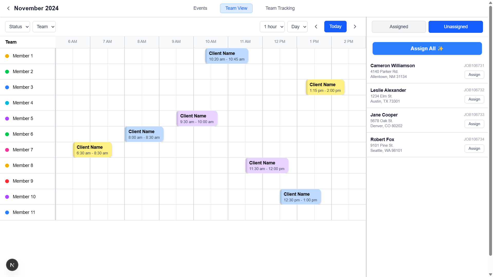
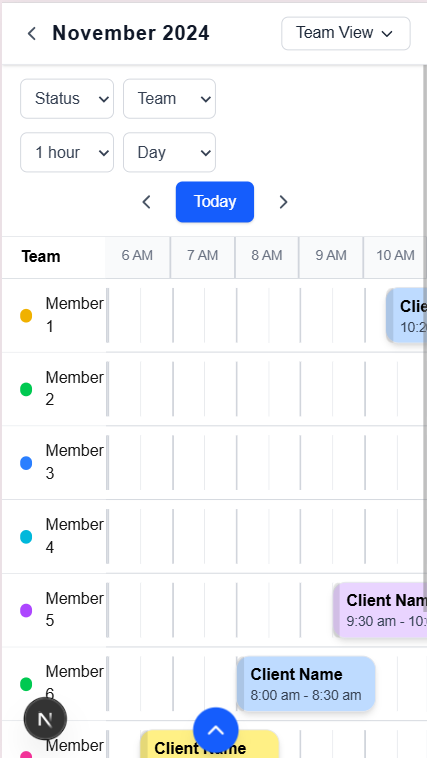
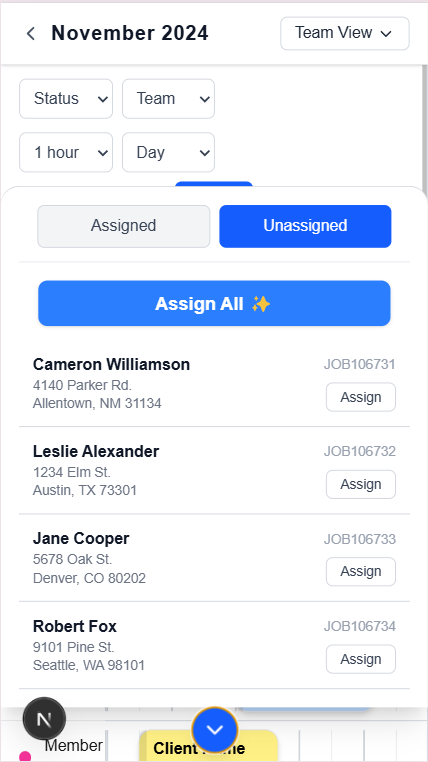

# Team Schedule UI

This project is a **Team Schedule Management UI** built using **Next.js**, **TypeScript**, and **Tailwind CSS**. It features a dynamic team scheduling system with animations and a sidebar for assigned/unassigned members.

### 🖥️ Laptop View



### 📱 Mobile View




## 🚀 Features

- **Team-wise Scheduling** with time slots.
- **Responsive Design** for all screen sizes.
- **Filter & Navigation Controls** (Status, Team, Time View).
- **Assigned & Unassigned Member Sidebar**.
- **Modern UI with Tailwind CSS**.

## 🛠️ Tech Stack

- **Next.js 14+** (React Framework)
- **TypeScript** (Static Typing)
- **Tailwind CSS** (Styling)
- **Framer Motion** (Animations)

## 📦 Installation

1. Clone the repository:
   ```sh
   git clone https://github.com/Bhavdeep198/team-schedule.git
   ```
2. Navigate to the project directory:
   ```sh
   cd team-schedule-ui
   ```
3. Install dependencies:
   ```sh
   npm install  # or yarn install
   ```
4. Run the development server:
   ```sh
   npm run dev  # or yarn dev
   ```

## 📸 Screenshots

_Add screenshots/gifs of the UI to showcase functionality._

## 🎨 UI Improvements

- Smooth animations added for better UX.
- Hover effects on buttons.
- Smooth entry effects for assigned slots.

## 🤝 Contributing

Feel free to submit issues and pull requests.

## 📜 License

This project is licensed under the MIT License.

---

💡 _Developed by [Bhavdeep Patel]._
